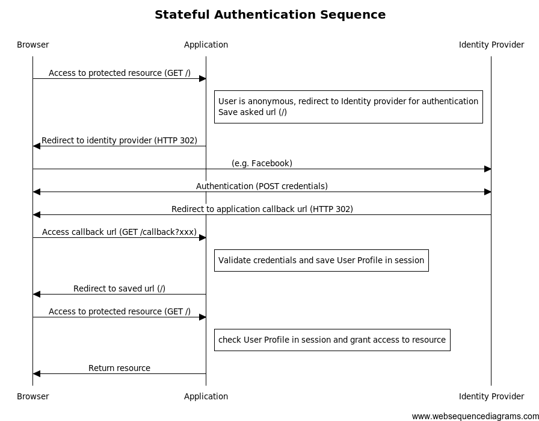
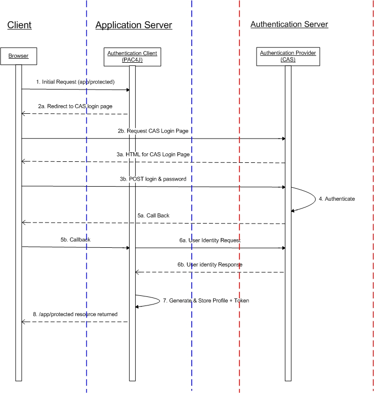
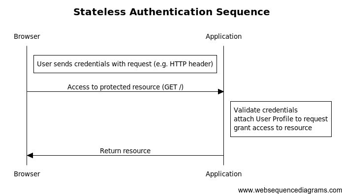

# 认证流程

## 1）界面认证（有状态/间接客户端）

*pac4j* 支持**界面认证**，即**有状态/间接客户端**：用户被重定向到外部认证提供者，登录并最终重定向回应用程序。

### 特定于 CAS 的状态认证流：

## 2）Web 服务认证（无状态/直接客户端）

*pac4j* 还支持 **web服务认证**，即**无状态/直接客户端**：凭证随HTTP请求一起传递，必须定义一个 `Authenticator` 来验证凭证（也可以定义一个特定的 `ProfileCreator` 来从另一个源获取用户配置文件）。

> [原文链接](https://www.pac4j.org/5.7.x/docs/authentication-flows.html)
